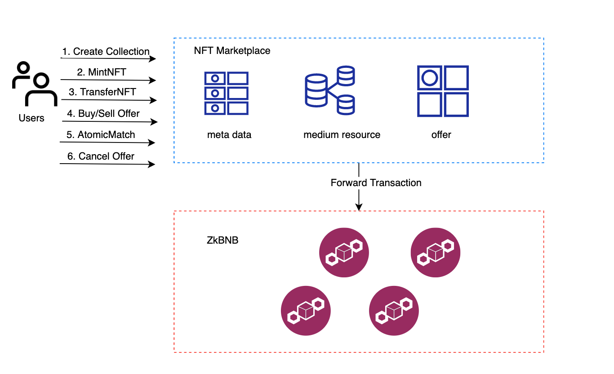

## Key Features

### Digital Asset Management
The zkBNB will serve as an alternative marketplace for issuing, using, paying and exchanging digital assets in a
decentralized manner. zkBNB and BSC share the same token universe for BNB, BEP2 and NFT tokens. This defines:
- The same token can circulate on both networks, and flow between them bi-directionally via L1 <\> L2 communication.
- The total circulation of the same token should be managed across the two networks, i.e. the total effective supply
  of a token should be the sum of the token's total effective supply on both BSC and BC.
- The tokens can only be initially created on BSC in BEP20, then pegged to the zkBNB. It is permissionless to peg token onto zkBNB.

User can **deposit, transfer, and withdraw** both non-fungible token and fungible token on zkBNB.

Users enter the zk-rollup by **depositing tokens** in the rollup's contract deployed on the BSC. The zkBNB monitor will track deposits and submit it as a layer2 transaction, once committer verifies the transaction, users get funds on their account, they can start transacting by sending transactions to the committer for processing.

User can **transfer** any amount of funds to any existed accounts on zkBNB by sending a signed transaction to the network.

**Withdrawing** from zkBNB to BSC is straightforward. The user initiates the withdrawal transaction, the fund will be
burned on zkBNB. Once the transaction in the next batch been rolluped, a related amount of token will be unlocked from
rollup contract to target account.

### NFT Management and Marketplace
We target to provide an opensource NFT marketplace for users to browse, buy, sell or create their own NFT.
The meta-data of NFT on zkBNB sticks to the [BSC standard](https://docs.bnbchain.org/docs/nft-metadata-standard/).
The ERC721 standard NFT can be seamlessly deposited on zkBNB, or in reverse.

Above diagram shows the framework of Nft Marketplace and zkBNB. All the buy/sell offer, meta-data of NFT/Collection,
medium resources, account profiles are store in the backend of NFT marketplace, only the **contendHash**,
**ownership**, **creatorTreasuryRate** and few other fields are recorded on zkBNB. To encourage price discovery, anyone
can place buy/sell offer in the marketplace without paying any fees since the offer is cached in the backend instead of
being sent to the zkBNB. Once the offer is matched, an **AtomicMatch** transaction that consist of buy and sell offer
will be sent to zkBNB to make the trade happen. Users can also cancel an offer manually by sending a cancel offer
transaction to disable the backend cached offer.

### Seamless L1 Wallet Management
zkBNB natively supports ECDSA signatures and follows [EIP712](https://github.com/ethereum/EIPs/blob/master/EIPS/eip-712.md) signing structure, which means most of the Ethereum wallets can seamless support zkBNB. There is no extra effort for BSC users to leverage zkBNB.