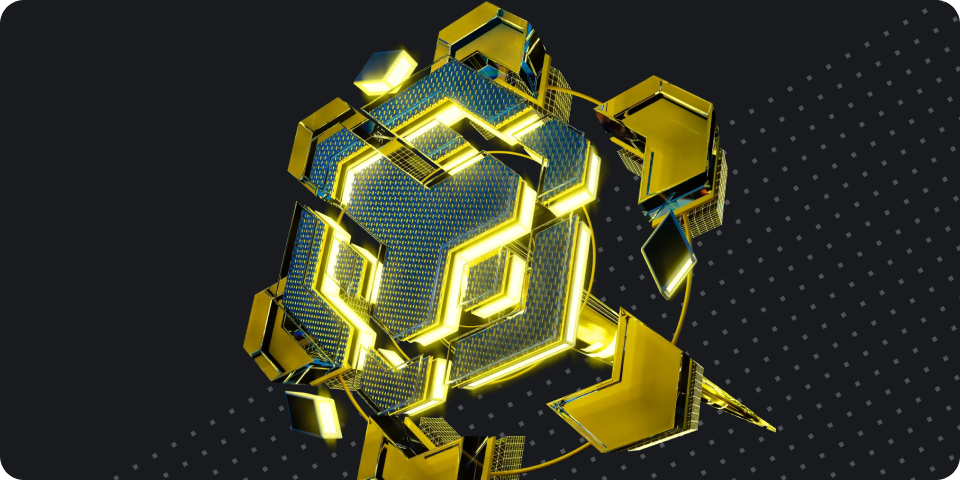

---
hide:
- toc
---

    

        <h1>zkBNB</h1>
        
zkBNB is the launchpad to achieve infinite scaling for all things Web3 and GameFi. It offers incredible scalability, Layer-1 level security, and frictionless developer experience to build dApps that can onboard the next billion users.

    

    

        
    

    <a href="./core-concept/zkbnb-arch.md">
        
Architecture

        
zkBNB is a zero-knowledge scalability solution

    </a>
    <a href="./resources.md">
        
Resources

        
Providing a Wealth of Resources for Building zkBNB

    </a>

