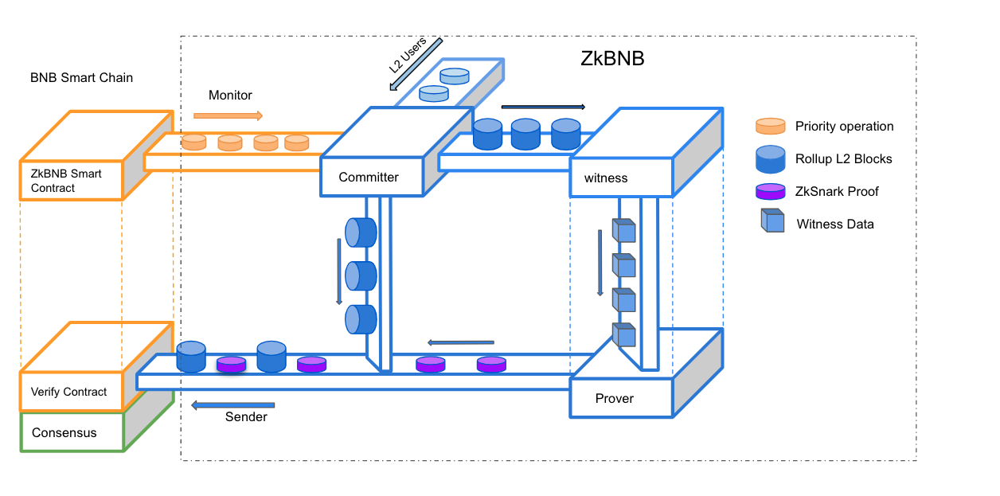

# Architectural Details of ZkBNB

Increased throughput and scalability are two of the most desired requirements of any blockchain ecosystem to thrive in the competitive industry of Web3. Several solutions have been proposed to achieve this, however, one of the latest and touted solutions is the one based on Zero Knowledge (ZK) Proofs. Joining the bandwagon of providing groundbreaking scalability solutions based on ZK-Proofs is the world's third largest smart contract network, BNB Chain.

Zero-Knowledge Rollups (ZkRollups) are Layer-2 (L2) blockchain scalability solutions based on ZK-Proofs. ZK-Rollups essentially scales the main blockchain network, i.e., Layer-1(L1), by performing computations, bundling transactions, and moving the transaction data off the main blockchain, making sure in this way that the network on the main chain does not become congested.

Harnessing the power of ZK-Rollups, BNB Chain has introduced ZkBNB which is considered a breakthrough in the scalability solutions for blockchain technologies. ZkBNB is an infrastructure designed for developers to build large-scale BSC-based applications with higher throughput and much lower or even zero transaction fees.

In this document, we dive deep into the underlying architecture that makes ZkBNB a ground-breaking innovation, covering the underlying ZkRollup architecture, protocol overview, key technologies used, and the tokenomics of the ZkBNB infrastructure.

## ZkBNB - the Underlying ZkRollup Architecture

Built on ZK Rollup architecture, ZkBNB is capable of bundling (or "rolling-up") hundreds of transactions off-chain and then generating cryptographic proof for proving the validity of the transactions, included in each batch. The cryptographic proofs are in the form of SNARKs (succinct non-interactive argument of knowledge), which can prove the validity of every single transaction in the rolled up block. It means, all funds are held on the BSC, while computation and storage are performed on BNB Application Sidechains (BAS), with less cost and fast speed. Furthermore, because of the use of Zk-SNARK proofs, ZkBNB shares the same security as that of BSC.

## ZkBNB Framework

The different key components of the ZkBNB infrastructure, as illustrated in the figure above, are listed below:

-   **Committer:** The committer is responsible for executing transactions and producing consecutive blocks.
-   **Monitor:** The Monitor component tracks events on BSC, and translates them into transactions on ZkBNB.
-   **Witness:** The Witness component is responsible for re-executing the transactions within a rollup block and generating witness materials.
-   **Prover:** Prover is responsible for generating cryptographic proof based on the witness materials.
-   **Sender:** The Sender rollups the compressed L2 blocks into L1, and submits proof to verify them.
-   **API Server:** The API Server is the access endpoint for most users; it provides rich data, including digital assets, blocks, transactions, swap info, and gas fees.
-   **Recovery:** A tool to recover the Sparse Merkle tree in kv-rocks based on the state world in PostgreSQL.

## ZkBNB Protocol Overview

ZkBNB is an implementation of the ZK-Rollup protocol, that provides built-in features like:

-   Deposit and transfer functionalities for BNB and BEP20 fungible tokens
-   AMM-based fungible token swap on L2
-   Deposit and transfer of BEP721 Non-Fungible Tokens (NFTs)
-   Minting of BEP721 Non-Fungible Tokens on L2
-   Out-of-the-box NFT-marketplace on L2

The general rollup workflow in ZkBNB is as follows:

-   Users can become owners in the rollup operation by calling registerZNS in L1 to register a short name for L2;
-   Owners can transfer assets to each other, mint NFTs on L2, or make a swap on L2;
-   Owners can withdraw assets under their control to any L1 address.

It is to note here that Rollup operation in the ZkBNB framework requires the assistance of a committer. The committer here is responsible for rolling transactions together. Other than this, a prover is also responsible for computing the zero-knowledge proof of the correct state transition. Additionally, the prover also affects the state transition by interacting with the rollup contract.

For more details on protocol design, refer [here](https://github.com/bnb-chain/zkbnb/blob/master/docs/protocol.md).

## Mechanism Behind Cutting-Edge Features

The working of some of the most important features revolving around the issue of throughout, availability, and scalability that are offered seamlessly by ZkBNB is as follows:

#### **Data Availability** 

The state data for every transaction processed off-chain is published by ZkBNB onto BSC. Due to this data, it is possible to reproduce the rollup's state for an individual or a business to validate the chain themselves. BSC makes this transaction data available to all of the network's participants in the form of **calldata**.

It is to note here that it is not required by ZkBNB to publish extensive transaction data on-chain, i.e., BSC main chain. This is large because the validity proofs generated with each rollup batch already verify the authenticity of state transitions. Nevertheless, it is still important to store transactions on-chain because it allows permissionless, independent verification of the L2 chain's state, allowing anyone to submit batches of transactions. In doing so, malicious committers are prevented from censoring or freezing the L2 chain.

ZkBNB provides a default client that is responsible for replaying all states on Layer-2 based on the **calldata** available on BSC.

#### Transaction Finality

In the ZkBNB setup, BSC acts as a settlement layer for ZkBNB. This means that all Layer-2 transactions are finalized, only in case the Layer-1 contract accepts the validity proof and executes the transactions. This condition eliminates the risk of malicious operators corrupting the Layer-2 chain (e.g., stealing roll-up funds), since every transaction must also be approved on the Layer-1 (Mainnet). Furthermore, BSC guarantees that user operations cannot be reversed once finalized on Layer-1. To provide an enhanced user experience, ZkBNB provides a relatively fast finality speed of approximately 10 minutes.

However, this does not affect the usability of the network. The state transition is designed to happen immediately once the block has been proposed on the ZkBNB. Furthermore, rollup operations are totally transparent to the users, allowing the users to make further transfers without waiting.

#### Censorship resistance

In the ZkBNB setup, the committer is responsible for executing transactions and producing rollup batches. While this ensures efficiency, it increases the risk of censorship in the way that a malicious ZK-rollup committer can censor users by refusing to include their transactions in the rollup batches.

As a counter-security measure to censorship, ZkBNB allows users to submit transactions directly to the rollup contract on the BSC Mainnet if they feel that they are being censored by the ZkBNB operator. This feature allows users to force an exit from the ZkBNB to BSC without having to rely on the committer's permission.

## API Reference

For details on API reference, refer [here](https://github.com/bnb-chain/zkbnb/blob/master/docs/api_reference.md).