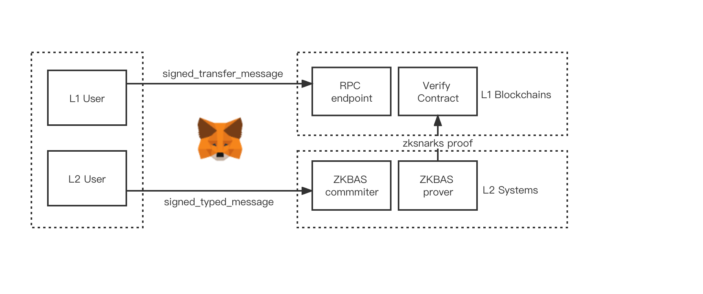
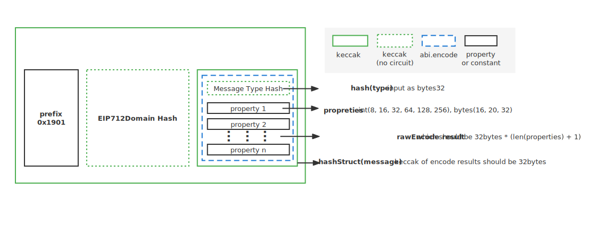

# ZkBNB 지갑

## L1 지갑 지원 소개

ZkBNB는 ZK 롤업 아키텍처 상에서 만들어졌습니다.
ZkBNB는 오프체인 상의 수백 개 트랜잭션을 번들 단위로 묶고 암호학적 증거를 생성합니다.

사용자의 편의를 위해 ZkBNB는 EIP-712 표준 서명을 통해 구조화된 메세지든 서명할 수 있으며 주요 레이어1 지갑(메타마스크, 트러스트 월렛 등)을 지원하는 새로운 버전을 구현하였습니다.

사용자는 EIP 서명 표준을 지원하는 지갑을 사용하면 누구나 ZkBNB에 접근할 수 있으며, 위에서 설명한 지갑에서 ecdsa(secp256k1) 개인 키를 기를 가져와서 간단하게 L2 자산 (NFT, 토큰 등)을 관리할 수 있습니다.

**참고: 현재 이 기능은 개발 중에 있습니다**



## EIP-712 표준 적용

[EIP-712](https://eips.ethereum.org/EIPS/eip-712)은 해싱(hashing)과 타입 구조화된(typed structured) 데이터를 서명하는 표준입니다 (bytestrings를 사용하는 것과 반대).
이는 다음을 포함합니다.

* 인코딩 함수의 정확성을 위한 이론적 프레임워크
* 솔리디티 structs와 호환되는 구조체 데이터 세부사항 정의
* 구조체의 인스턴스를 위한 안전한 해싱 알고리즘
* 서명 가능한 메세지 집합에 해당 인스턴스 안전하게 포함
* 도메인 분리를 위한 확장 메커니즘
* 새로운 RPC가 호출하는 eth_signTypedData,
* EVM의 적용된 해시 알고리즘의 최적화

### EIP-712의 구현 개요

EIP-712 표준은 아래와 같이 적용되었습니다.



아래는 암호화와 서명 구조를 아래서부터 위로 다룹니다.

1. **hash(type)** 라 부르는 메세지 타입의 해시
2. hash(type)의 rawEncode와 메세지 엔티티(entity) 속성을 **rawEncode result**라고 합니다. rawEncode result는 rawEncode(hash(type), properties...)와 같이 표현할 수 있습니다.
3. rawEncode 결과의 해시를 **hashStruct(message)**
4. ashStruct(message)와 같은 구조를 갖는 EIP712Domain의 hashStruct를 **hashStruct(EIP712Domain)**이라고 합니다.
5. prefixd 및 hashStruct(EIP712Domain)와 hashStruct(message)를 합치면 **bytesConcat**가 나옵니다.
6. bytesConcat의 해시를 **hash(bytesConcat)** 라고 표현합니다.
7. 개인키를 이용해 해시(bytesConcat)를 서명하고, secp256k1을 기반으로 최종 ecdsa 서명을 생성합니다.

### 타원 곡선 적용

EIP-712 표준 서명 체계를 적용하기 위해, ZkBNB는 ecc 서명 알고리즘 타원 곡선을 기존 eddsa에서 ecdsa로 전환합니다. 정확하게는 EVM 기반 블록체인에서 사용되는 secp256k1를 사용합니다. 

또한, ecdsa으로 전환을 지원하기 위해 ZkBNB에서는 zksnarks 증명 시스템도 groth16 검증 컨트랙트를 쓰는 groth16에서 plonk 검증 컨트랙트를 사용하는 plonk로 전환합니다.

*현재 이 기능을 개발 단계이며, 곧 지원될 예정입니다.*

### 해시 함수 적용

EIP-712 표준 서명 체계를 적용하기 위해, ZkBNB는 기존 해시 알고리즘인 MIMC에서 Keccak256(SHA-3)으로 전환합니다.

회로 상 keccak256은 여전히 keccak 함수의 복잡성에 따른 힌트 범위에 있으며, 회로에 순수 구현하는 것은 **20만**개 이상의 제약 조건이 추가됩니다.

*팁: [EIP-712 구현 개요](#EIP-712의_구현_개요)에서 볼 수 있듯이, hashStruct(eip712domain)와  hash(type) 의 해시 결과는 회로에서 상수를 통해 건너 뛸 것이며, keccaks 시간을 상당히 줄일 수 있습니다*

*f.g. prefix + hashStruct(EIP712Domain)를 아래 코드와 같이 적용합니다:*
```golang=
var HexPrefixAndEip712DomainKeccakHash = "1901b4c86e5ff1abb2a7aae82a5ced0f0733dfd26fbef5c4713bfbf42d46a73e21c4"
```
*f.g. 전송을 위한 해시(타입)를 아래와 같이 적용합니다*
```golang=
HexEIP712MessageTypeHash[Transfer] = "96695797a85b65c62a1eb8e28852fc7d5a34b668e127752d9a132d6d5e2d3717"
```

### 인코드 적용

EIP-712 표준 서명 체계를 적용하기 위해, ZkBNB는 트랜잭션의 인코딩 방식을 [EIP-712 구현 개요](#EIP-712의_구현_개요)에 설명처럼 원래 모든 바이트를 ERC-721로 합치는 방법에서 서명된 타입메세지로(typed message)로 인코딩합니다.

다시말해 encode는 표준이 아닌 abi.encode 함수로 변경되었으며, 타입 해시를 첫 입력값으로 하고 나머지에 특성을 입력하는 생성자 abi.encode를 각 트랜잭션에 사용합니다.
abi.encode에 대해서는 [여기](https://docs.soliditylang.org/en/v0.8.15/abi-spec.html)를 참고하세요.

모든 트랜잭션의 메세지는 [트랜잭션 유형 정의](#typed-message-definition-of-all-transactions)에 소개되어 있습니다.
Circuit의 abi.encode는 여전히 힌트 범위에 있습니다.

## 타입메세지 서명

아래는 타입메세지(TypedMessage)의 타입스크립트 정의입니다. 타입메세지는 타입 정의를 위해 types를 사용하며, primaryType을 정해진 인코딩 유형으로 설정하며, message를 서명해야 하는 값으로, 도메인을 EIP712Domain으로 설정합니다.

```typescript=
/**
* `signTypeData`에 사용된 메세지 형식이며,
* `V1`을 제외한 모든 버전에서 사용됩니다.
*
* @template T - 메세지에서 사용한 커스텀 유형.
* @property types - 메세지에서 사용한 커스텀 유형.
* @property primaryType - 메세지 유형.
* @property domain - 도메인 메타데이터 서명. 서명 도메인 서명에 대한 컨텍스트(context)입니다 
* (예시. dapp, 프로토콜 등 의도된 맥락에 사용).
* 데이터는 메세지의 분리기를 만들기 위해 사용됩니다.
* @property domain.name - 서명하는 도메인의 이름.
* @property domain.version - 서명하는 도메인의 버전.
* @property domain.chainId - 서명하는 도메인의 체인 ID.
* @property domain.verifyingContract - 서명 검증할 수 있는 컨트랙트의 주소.
* @property domain.salt - A disambiguating salt for the protocol.
* @property message -서명받을 주소. The message to be signed.
*/
export interface TypedMessage<T extends MessageTypes> {
   types: T;
   primaryType: keyof T;
   domain: {
       name?: string;
       version?: string;
       chainId?: number;
       verifyingContract?: string;
       salt?: ArrayBuffer;
   };
   message: Record<string, unknown>;
}
```

### 모든 트랙잭션에 대한 메세지 유형 정의

아래는 트랜잭션과 EIP721 도메인에 대한 타입스크립트 정의입니다. 이러한 유형으로 분류된 메세지는 EIP-721 서명 체계를 지원하는 모든 지갑에서 사용할 수 있으며 L2 검증, 실행 준비 및 롤업 증거 생성을 위한 서명으로 사용할 수 있습니다.

#### EIP712 도메인
```typescript=
    const types = {
        EIP712Domain: [
            { name: 'name', type: 'string' },
            { name: 'version', type: 'string' },
            { name: 'chainId', type: 'uint256' },
            { name: 'verifyingContract', type: 'address' },
            { name: 'salt', type: 'bytes32' },
        ],
```        

#### EIP712 도메인 정적 값
```typescript=
    const salt = Buffer.from(
        '0xf2d857f4a3edcb9b78b4d503bfe733db1e3f6cdc2b7971ee739626c97e86a558',
        'hex',
    );
    const domain = {
        name: 'ZkBNB',
        version: '1.0',
        chainId: 10,
        verifyingContract: '',
        salt: salt,
    };    
```        

#### 메세지
##### 전송
```typescript=
        Transfer: [
            { name: 'FromAccountIndex', type: 'uint256' },
            { name: 'ToAccountIndex', type: 'uint256' },
            { name: 'ToAccountNameHash', type: 'bytes32' },
            { name: 'AssetId', type: 'uint256' },
            { name: 'packedAmount', type: 'uint256' },
            { name: 'GasAccountIndex', type: 'uint256' },
            { name: 'GasFeeAssetId', type: 'uint256' },
            { name: 'packedFee', type: 'uint256' },
            { name: 'CallDataHash', type: 'bytes32' },
            { name: 'ExpiredAt', type: 'uint256' },
            { name: 'Nonce', type: 'uint256' },
            { name: 'ChainId', type: 'uint256' },
        ],
```
##### 출금
```typescript=
        Withdraw: [
            { name: 'FromAccountIndex', type: 'uint256' },
            { name: 'AssetId', type: 'uint256' },
            { name: 'AssetAmount', type: 'bytes16' },
            { name: 'GasAccountIndex', type: 'uint256' },
            { name: 'GasFeeAssetId', type: 'uint256' },
            { name: 'GasFeeAssetAmount', type: 'uint256' },
            { name: 'ToAddress', type: 'bytes20' },
            { name: 'ExpiredAt', type: 'uint256' },
            { name: 'Nonce', type: 'uint256' },
            { name: 'ChainId', type: 'uint256' },
        ],
```        
##### 컬렉션 생성
```typescript=
        CreateCollection: [
            { name: 'AccountIndex', type: 'uint256' },
            { name: 'GasAccountIndex', type: 'uint256' },
            { name: 'GasFeeAssetId', type: 'uint256' },
            { name: 'GasFeeAssetAmount', type: 'uint256' },
            { name: 'ExpiredAt', type: 'uint256' },
            { name: 'Nonce', type: 'uint256' },
            { name: 'ChainId', type: 'uint256' },
        ],
```        
##### NFT 민팅
```typescript=
        MintNft: [
            { name: 'CreatorAccountIndex', type: 'uint256' },
            { name: 'ToAccountIndex', type: 'uint256' },
            { name: 'ToAccountNameHash', type: 'bytes32' },
            { name: 'NftContentHash', type: 'bytes32' },
            { name: 'GasAccountIndex', type: 'uint256' },
            { name: 'GasFeeAssetId', type: 'uint256' },
            { name: 'GasFeeAssetAmount', type: 'uint256' },
            { name: 'CreatorTreasuryRate', type: 'uint256' },
            { name: 'NftCollectionId', type: 'uint256' },
            { name: 'ExpiredAt', type: 'uint256' },
            { name: 'Nonce', type: 'uint256' },
            { name: 'ChainId', type: 'uint256' },
        ],
```        
##### NFT 전송
```typescript=
        TransferNft: [
            { name: 'FromAccountIndex', type: 'uint256' },
            { name: 'ToAccountIndex', type: 'uint256' },
            { name: 'ToAccountNameHash', type: 'bytes32' },
            { name: 'NftIndex', type: 'uint256' },
            { name: 'GasAccountIndex', type: 'uint256' },
            { name: 'GasFeeAssetId', type: 'uint256' },
            { name: 'GasFeeAssetAmount', type: 'uint256' },
            { name: 'CallDataHash', type: 'bytes32' },
            { name: 'ExpiredAt', type: 'uint256' },
            { name: 'Nonce', type: 'uint256' },
            { name: 'ChainId', type: 'uint256' },
        ],
```        
##### NFT 출금
```typescript=
        WithdrawNft: [
            { name: 'AccountIndex', type: 'uint256' },
            { name: 'NftIndex', type: 'uint256' },
            { name: 'ToAddress', type: 'bytes20' },
            { name: 'GasAccountIndex', type: 'uint256' },
            { name: 'GasFeeAssetId', type: 'uint256' },
            { name: 'GasFeeAssetAmount', type: 'uint256' },
            { name: 'ExpiredAt', type: 'uint256' },
            { name: 'Nonce', type: 'uint256' },
            { name: 'ChainId', type: 'uint256' },
        ],
```        
##### 오퍼 취소
```typescript=
        CancelOffer: [
            { name: 'AccountIndex', type: 'uint256' },
            { name: 'OfferId', type: 'uint256' },
            { name: 'GasAccountIndex', type: 'uint256' },
            { name: 'GasFeeAssetId', type: 'uint256' },
            { name: 'GasFeeAssetAmount', type: 'uint256' },
            { name: 'ExpiredAt', type: 'uint256' },
            { name: 'Nonce', type: 'uint256' },
            { name: 'ChainId', type: 'uint256' },
        ],
```     
##### 아토믹 매칭
```typescript=
        AtomicMatch: [
            { name: 'sellerAccountIndex', type: 'uint256' },
            { name: 'sellerNftIndex', type: 'uint256' },
            { name: 'sellerOfferId', type: 'uint256' },
            { name: 'sellerType', type: 'uint256' },
            { name: 'sellerAssetId', type: 'uint256' },
            { name: 'sellerAssetAmount', type: 'uint256' },
            { name: 'sellerListedAt', type: 'uint256' },
            { name: 'sellerExpiredAt', type: 'uint256' },
            { name: 'sellerTreasureRate', type: 'uint256' },
            { name: 'sellerSigR', type: 'bytes32' },
            { name: 'sellerSigS', type: 'bytes32' },
            { name: 'buyerAccountIndex', type: 'uint256' },
            { name: 'buyerNftIndex', type: 'uint256' },
            { name: 'buyerOfferId', type: 'uint256' },
            { name: 'buyerType', type: 'uint256' },
            { name: 'buyerAssetId', type: 'uint256' },
            { name: 'buyerAssetAmount', type: 'uint256' },
            { name: 'buyerListedAt', type: 'uint256' },
            { name: 'buyerExpiredAt', type: 'uint256' },
            { name: 'buyerTreasureRate', type: 'uint256' },
            { name: 'buyerSigR', type: 'bytes32' },
            { name: 'buyerSigS', type: 'bytes32' },
            { name: 'Nonce', type: 'uint256' },
            { name: 'ChainId', type: 'uint256' },
        ],
    };
```